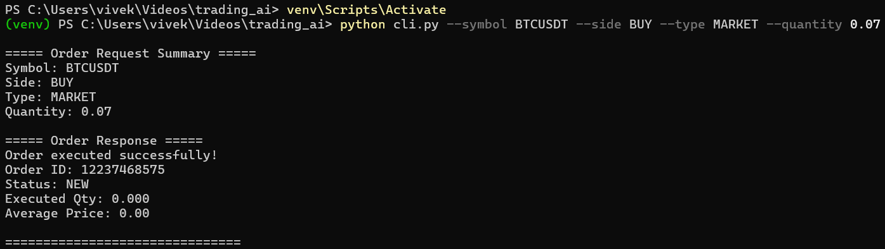
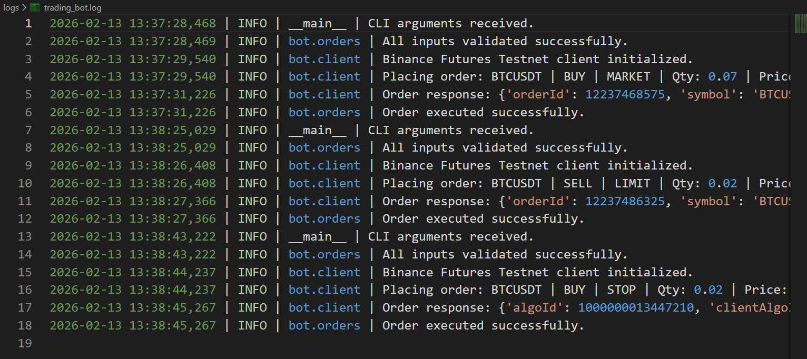

# Binance Futures TESTNET Trading bot
A structured Python CLI trading bot that places orders on Binance USDT-M Futures Testnet.

---

## Project Overview

This project is a Python-based CLI trading bot designed to interact with the Binance USDT-M Futures Testnet. The application allows users to place MARKET, LIMIT, and STOP orders through a command-line interface while maintaining a clean and concise structure. The system is built with clear separation of validation layer for checking the inputs, a logic layer for order handling and a client layer for Binance API communication. Robust error handling ensures that invalid inputs and API errors are managed gracefully. Additionally, the application implements structured logging with separate log files for concise summaries and raw API responses, enabling both, a clean user interaction and detailed debugging capability.

---
## Features

**Core requirements Implemented**  
- Place **MARKET** orders
- Place **LIMIT** orders
- Support both **BUY** and **SELL**
- CLI-based input
- Structured logging
- Error handling
- Clean project architecture


**Bonus Implemented**  
- Supports **STOP** orders as well
- Separate log file for structured and raw **API JSON** reponses

---

## Technologies Used

- Python 3.13.3
- python-binance library
- Argspace library
- Binance Futures TESTNET API

---

## Project Structure
```bash
trading_ai/
├── bot/
│   ├── __init__.py
│   ├── client.py
│   ├── orders.py
│   ├── validators.py
│   └── logging_config.py
├── logs/
├── cli.py
├── requirements.txt
├── README.md
└── .env
```
---

## Setup Instructions
### Clone the Repository

```bash
git clone https://github.com/vivekisntit/binance-futures-trading-ai.git
cd binance-futures-trading-ai
```
### Create virtual environment
```bash
python -m venv venv
venv\Scripts\activate
```

### Install Dependencies
```bash
npm install -r requirements.txt
```

### Create .env file
use this link to get api: https://demo.binance.com/en/my/settings/api-management
```bash
BINANCE_API_KEY=ONLY_testnet_api_key
BINANCE_SECRET_KEY=ONLY_testnet_secret_key
```

---

## Example CLI Usage

### MARKET order
```bash
python cli.py --symbol BTCUSDT --side BUY --type MARKET --quantity 0.07
```



### LIMIT order
```bash
python cli.py --symbol BTCUSDT --side SELL --type LIMIT --quantity 0.02 --price 70000
```


### STOP order
```bash
python cli.py --symbol BTCUSDT --side BUY --type STOP --quantity 0.02 --price 70000 --stop_price 69000
```


### LOG folder
#### Raw API LOG


#### Structured LOG


